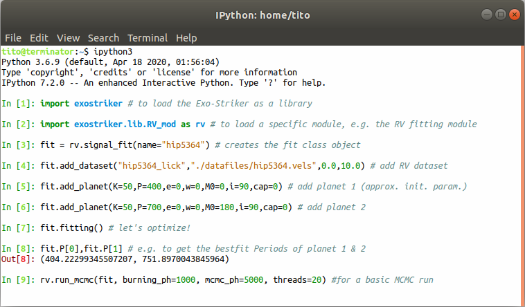

**T**ransit and **R**adial velocity **I**nteractive **F**itting tool for **O**rbital analysis and **N**-body simulations: **The Exo-Striker** 

  

 
The Exo-Striker analyzes exoplanet orbitals, performs N-body simulations, and models the RV stellar reflex motion caused by dynamically interacting planets in multi-planetary systems. It offers a broad range of tools for detailed analysis of transit and Doppler data, including power spectrum analysis for Doppler and transit data; Keplerian and dynamical modeling of multi-planet systems; MCMC and nested sampling; Gaussian Processes modeling; and a long-term stability check of multi-planet systems. The Exo-Striker can also perform Mean Motion Resonance (MMR) analysis, create fast fully interactive plots, and export ready-to-use LaTeX tables with best-fit parameters, errors, and statistics. It combines Fortran efficiency and Python flexibility and is cross-platform compatible (MAC OS, Linux, Windows). 

 

  

**Documentation, Instructions, and Tutorials**

* (Work in progress) documentation is available at [https://exo-striker.readthedocs.io](https://exo-striker.readthedocs.io/en/exostriker-ready/)).

**Developer**

* Trifon Trifonov, MPIA Heidelberg.
* with contributions by Mathias Zechmeister, Jakub Morawski, Man Hoi Lee, Stefan Dreizler, Grigorii Smirnov-Pinchukov, Stephan Stock, Jonas Kemmer, Harry Psarakis, and Desislava Antonova.

**What works**:

* RV signal and alias search: via GLS periodogram & maximum lnL periodogram (MLP).
* Transit signal search (via "TLS").
* Interactive transit photometry detrending (via "wotan"), interactive outlier removal, and more.
* Keplerian and Dynamical modeling of RV & Transit photometry exoplanet data.
* Joint RVs + Transit + GPs best-fit optimization (internal Fortran Simplex and L-M minimizers, or many more via "SciPyOp").
* Joint RVs + Transit + GPs MCMC/Nested Sampling (via "emcee" & "dynesty") 
* TTVs extraction.
* TTVs and/or joint TTVs + RVs analysis.
* Relative astrometry fitting.
* GP modeling (via "celerite").
* Linear models for detrending ground-based transit photometry.
* Activity index signal search via GLS periodogram.
* RVs vs. Activity time-series correlation analysis/plots.
* RV auto-fit (RV automated planet-finder algorithm).
* Fit for apsidal orbital precession, or apply General Relativity (GR) precession. 
* Instant online access to the "RVBank" database (over 212 000 RVs and activity indices of about 3000 HARPS stars & over 64 000 RVs and activity indices of about 1700 HIRES stars !!!).
* Instant AMD stability check for multiple planetary systems (including during optimization or MCMC/Nested Sampling).
* Long-term stability check of multiple planetary systems using SyMBA, MVS, and MVS with a GR precession.
* Fully interactive, super-fast, high-quality, exportable plots.
* Handy "cornerplot" GUI control.
* Import/Export of work sessions and multi-sessions. 
* Export plots to a matplotlib window for further customization.
* Export ready to use LaTeX tables with best-fit parameters, errors, and statistics. 
* Handy text-editor and calculator tools.
* Multi-platform: It works on MAC OS (10.6+), Linux (Suse, Mint, Ubuntu, etc.) and Windows 10.
* Integrated Bash-shell (Linux only).
* Integrated Jupyter shell.
* Importable as a standard python library (i.e., "import exostriker").
* Print the GUI screen into a .jpeg/.png image (useful for sharing quick results, just like the image above).
* Direct import of TESS & K2 *lc.fits, and CHEOPS *SCI_COR*.fits files.

**What is to be implemented**:

* Larger arsenal of N-body/dynamical simulation/analysis tools (+ "REBOUND" is planned to be included). 
* Internal TTV and photo-dynamical modeling (i.e. the external "TTVFast" will become a secondary option).
* Combined modeling with Astrometry (As of Ver 0.75 this is possible, but is still work in progress).

Please keep in mind that this software is developed mostly for my needs and fun. I hope, however, that you may find it capable of solving your scientific problems, too. At the moment, there is NO documentation,
but as you will find, the GUI is self-explanatory. I don't know of anybody who was lost in the GUI. The import as a Python library indeed needs documentation, but I plan to write such after approx. Ver. 0.8, when
most of the functions and classes will be firmly defined and will start optimizing the software core. 
If you need the Exo-Striker as a library, you can check the [Notebook_and_script_examples](https://github.com/3fon3fonov/exostriker/tree/exostriker-ready/Notebook_and_script_examples),
or drop me a line at trifonov@mpia.de for further instructions. 

Feedback and help in further development will be highly appreciated!
A wish-list with your favorite tools and methods to be implemented is also welcome!    

Just open an "Issue" on the GitHub, or send a PM to trifonov@mpia.de.    

**Installation**

 
Python3.8+ is strongly recommended!!! The Exo-Striker works with Python3.6,3.7 and even Python2, but you will likely have problems with some dependencies, which you may have to solve.
If your system Python3 is 3.6 or 3.7, it is recommended to not upgrade the python3, but to install python3.8 alongside your system python3. E.g., [see these instructions](https://linuxize.com/post/how-to-install-python-3-8-on-ubuntu-18-04/)

!!!!!!!!!!!!!!!!!!!!!!!!!!!!!!!!!!!!!!!!!!!!!!!!!!!!!!!!!!!!!!!!!!!!!!!!!!!!!!!!   

Let's assume, you have python3.8, then it is recommended to install pip3.8:

$ curl https://bootstrap.pypa.io/get-pip.py -o get-pip.py   
$ python3.8 get-pip.py    

Then to install the Exo-Striker:

$ pip3.8 install git+https://github.com/3fon3fonov/exostriker  --user  #(for user installation -- recommended!)

Then just run:

$ exostriker

WARNING! if you install with:

$ sudo pip3.8 install git+https://github.com/3fon3fonov/exostriker

then every time you should run:

$ sudo exostriker 

!!!!!!!!!!!!!!!!!!!!!!!!!!!!!!!!!!!!!!!!!!!!!!!!!!!!!!!!!!!!!!!!!!!!!!!!!!!!!!!!   

Alternativly, you can do a "git clone":

$ git clone https://github.com/3fon3fonov/exostriker   
$ cd exostriker   
$ python3.8 setup.py install   

However, please read the [Installation instructions](README_for_installation),
because some problems may occur depending on your OS system.   

!!!!!!!!!!!!!!!!!!!!!!!!!!!!!!!!!!!!!!!!!!!!!!!!!!!!!!!!!!!!!!!!!!!!!!!!!!!!!!!!   

Finally, you can run the Exo-striker after a "git clone":

$ git clone https://github.com/3fon3fonov/exostriker   
$ cd exostriker   
$ python3.8 exostriker_gui.py  

However, you must have all the needed dependencies in the setup.py installed 
IMHO this is somewhat more flexible, since one can have multiple "exostriker" 
directories dedicated to different projects. I usually do, "exostriker-GJ436", 
"exostriker-GJ876", etc., and I store all datafiles, sessions, plots, drafts, etc.,
inside these directories.
 

**Usage**

* To load the GUI, on a bash shell type: 

$ exostriker (in case of pip3.8 install, see above)

* or just do:

$ python3.8 exostriker_gui.py (inside of the git clone directory, see above)
 

* If you want to use the library on the Python shell/script

In [1]: import exostriker

* or e.g., to load the RV routines:

In [1]: import exostriker.lib.RV_mod as rv    
    
    
* Remember! Every button/action of the GUI is a wrapper of a convenient Python routine. Thus scripting is very easy:    

  

 
(However, one must be familiar with the functions and the 'fit' object... 
A manual is planned but not available at the moment.)

**Credit**

If you made the use of The Exo-Striker for your paper, I would appreciate it if you give credit to it.
As it is unlikely that I will find time to write a refereed paper on The Exo-Striker soon, please cite the tool with its ASCL ID ascl:1906.004 (see https://ascl.net/1906.004).    
 
The Exo-Striker relies on many open-source packages, which if you had made the use of (some of) them while working with the tool, 
you should acknowledge too. (It is your responsibility to find the correct references in the literature):    

* The interactive plotting is done with a custom version of the "pyqtgraph": 

http://www.pyqtgraph.org/

* "GLS" and "MLP" periodograms are taken from Mathias Zechmeister's repo: 

https://github.com/mzechmeister/python

* "TLS" and "wotan" are taken from: 

https://github.com/hippke/tls

https://github.com/hippke/wotan

* The transit modeling is done with "batman":
 
https://github.com/lkreidberg/batman

* MCMC sampling is done with "emcee": 

https://github.com/dfm/emcee

* Nested Sampling is done with "dynesty": 

https://github.com/joshspeagle/dynesty

* TTV models are adopted from "TTVfast-python":

https://github.com/mindriot101/ttvfast-python

* The "Text editor" used in the tool is a hack between "Megasolid Idiom" 
and "PyEdit2":

https://github.com/mfitzp/15-minute-apps/tree/master/wordprocessor

https://github.com/Axel-Erfurt/PyEdit2

* N-body tests are performed using a custom version of the "Swift" N-body library,
modified by Man Hoi Lee (HKU) and Trifon Trifonov (MPIA).

https://www.boulder.swri.edu/~hal/swift.html

* Additionally, the Exo-Striker uses many "standard" Python libraries like 
"PyQt5", "matplotlib", "numpy", "scipy", "dill", "Jupyter", "qtconsole",
and more.

* The Exo-Striker project was inspired by the Systemic project.

http://www.stefanom.org/systemic/

**Scientific papers which one way or another made the use of the Exo-Striker (to my knowledge):**

 
[Check in ADS](https://ui.adsabs.harvard.edu/abs/2019ascl.soft06004T/citations)

