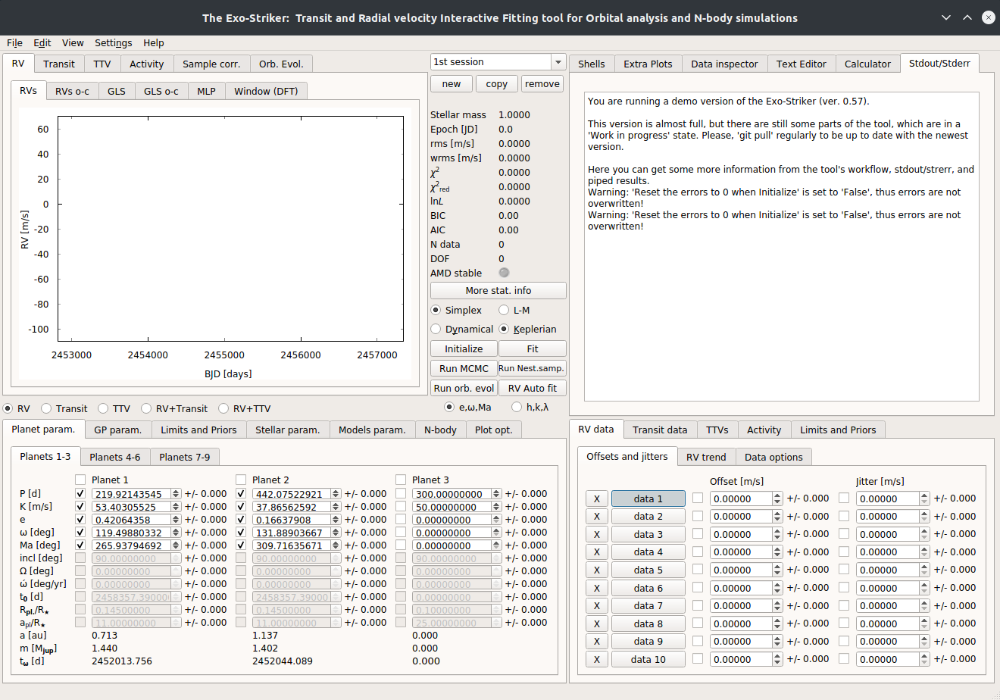

.. _gui:

GUI Layout
..........

Before starting the tutorials, it is kind to familiarize yourself with the
basic parameters that exostriker uses to determine the goodness of a fit but also
the ones that describe the planets orbits. All of these parameters can be seen on the 
homepage of exostriker.

   
   
   *Frontend of the GUI.*

------------------------------------------------------------------------------------------------------------

**Action menu bar**

* **File**: New session, open session/multi session, save session/multi session, open RVmod init file, open RVBank file, Quit.

* **Edit**: Push Jupyter var. to GUI, RV Auto fit, Reset mid-pannel buttons (dev-mode!).?

* **View**:
   **Print window GUI to file.**

   **Print f-test FAP**: ?

   .. Note::
      Each of the following "Get" actions is a command line to the Jupyter shell. You can
      modify its parameters, depending on the output.

   **Get LaTeX table with parameters**: best fit parameters as a LaTeX table (.tex file on your local exostriker folder). 

   **Get LaTex table with priors**: priors as a LaTeX table (.tex file on your local exostriker folder).

   **Get RV model**: models information, BJD[days] / RV model[m/s] (.txt file on your local exostriker folder).

   **Get RV data**: datapoints information, BJD[days]/ RVs[m/s]/ RVs errors[m/s]/ Number of dataset starting from 0 (.txt file on your local exostriker folder).

   **Get Orb evol.**: orbital parameters, Semimajor axis[au]/ Eccentricity/ Arg. of periastron[deg]/ Mean anomaly[deg]/ Inclination[deg]/ Longitude of the ascending node[deg] (.txt file on your local exostriker folder).

   **Confidence interval table.**

* **Settings**: Change widget style, GUI & plots font.

* **Help**: Exostriker page on Github & Credits.

* **Control Sessions**: Navigate through sessions (new/copy/remove session).

**Statistical parameters**

* **rms**: root-mean-square.
* **wrms**: weighted root-mean-square.
* **χ**\ :sup:`2`: chi-squared.
* **χ**\ :sup:`2` :sub:`reduced`\ : chi-squared reduced.
* **lnL** : likelihood function.
* **BIC** : Bayesian information criterion.
* **AIC** : Akaike information criterion.
* **N data**: number of data/observations.
* **DOF**: degrees of freedom.
* **AMD stable**: checking the stability of a system (Green/Red).
* **More stat.info**: provides information about the fit quality & RV data rms/wrms.

**Control parameters**

* **Simplex** : fitting curves using the Simplex algorithm.
* **L-M** : fitting curves using the Leveberg-Marquardt algorithm.
* **Keplerian** : perform a Keplerian analysis.
* **Dynamical**: perform a Dynamical analysis.
* **Initialize**: fitting any change without optimizing (pressing Enter).
* **Fit**: optimization parameter.
* **Run MCMC** : triggers samples using the Markov chain Monte Carlo algorithm.
* **Run Nest.samp** : triggers samples using the Nested sampling alogithm.
* **Run orbital evolution**: perform parameter evolution.
* **RV auto fit**: apply a curve to data.

**Input/Output parameters**

* **P [d]**: planets period.
* **K [m/s]**: planets RV amplitude. 
* **e**: eccentricity of the orbit.
* **ω [deg]**: argument of periastron.
* **Ma [deg]**: mean anomaly at the first observational epoch.
* **inc [deg]**: inclination of the orbit.
* **Ω [deg]**: longitude of the ascending node.  
* **ώ [deg/yr]**: rate of argument of periastron.
* **t**\ :sub:`0`\ **[d]**: time of the first transit.
* **R**\ :sub:`pl`\ /**R**\ :sub:`*`\ : planet radius in units of stellar radius.
* **a**\ :sub:`pl`\ /**R**\ :sub:`*`\ : planet semimajor axis in units of stellar radius.
* **a [au]**: semimajor axis.
* **m** [**M**\ :sub:`jup`\ ] : planets mass. 
* **t**\ :sub:`ω`\ [**d**]: time of periastron passage. 

----------------------------------------------------------------------------------------------------------

Data area
---------

Depending on the type of data that you are trying to fit, you can choose
between Radial Velocities (RV data), Transits (Transit data) and TTVs (Transit timing variations).

* RV data
   Load RVs, include Offset/Jitter parameters, choose a RV trend, bin data.

* Transit data
   Load Transits, include Offset/Jitter parameters, add Limb-darkening parameters to the model,
   detrend the data.

* TTVs (Transit-Timing Variations)
   Load TTVs, set the Epoch [BJD] of the first transit and the end of the model, choose a time step in dyn. model.

* Activity
   Load Activity indicators from your local folder, modify them and apply the changes.

* Limits and Priors
   Set limits to the parameters range.

------------------------------------------------------------------------------------------------------------

Help widgets area
-----------------

* Shells 
   *Exostriker* offers 3 command-line interpreters.

   **Jupyter**: A Qt-based console for working with Jupyter kernels. It provides a number of enhancements 
   only possible in a GUI, such as inline figures, proper multi-line editing with syntax highlighting, graphical
   calltips, and much more. For more information visit `qtconsole documentation`_.

   .. _qtconsole documentation : https://qtconsole.readthedocs.io/en/stable/

   **Bash shell**: Work in progress.

   **pqg shell**: PyQtGraph is a graphics and user interface library for Python. For more information visit `pyqtgraph documentation`_.

   .. _pyqtgraph documentation : https://pyqtgraph.readthedocs.io/en/latest/index.html

* Extra plots 
   In this section plots of the most prominent peaks of the RV data are displayed phase folded (phase diagrams).
   Additionally, periodograms of the RV data are included.   
   

      .. image:: images/extraplots.gif
         :target: _images/extraplots.gif

* Data inspector
   Inspect the data on your local machine through the options *This computer* or *RVBank* and load them to exostriker. 

      .. image:: images/datainspector.gif
         :target: _images/datainspector.gif

   The *RVBank* option offers data sets from *HARPS RVBank* and *HIRES NZP*. Choose between different types of RV data sets
   (RVs SERVAL + NZP correction etc.) and Activity indicators (CRX, dLW, .., etc.) 

      .. image:: images/datainspector1.gif
         :target: _images/datainspector1.gif

   Activity indicators can also be modified.

      .. image:: images/modactivity.gif
         :target: _images/modactivity.gif

* Text editor
   Through the *text editor* you can inspect and edit the data files. (Works for .dat, .tran, .vels extensions)

      .. image:: images/texteditor.gif
         :target: _images/texteditor.gif

* **Calculator**

* Stdout/Stderr
   This section provides information about the version of the GUI you are using. Also
   informs about the progress of all processes.

   .. WARNING::
      Before starting any project make sure that you run the latest version of *exostriker*. You can
      be updated about the latest version/updates of *exostriker* on exostriker's `github page`_ .
      
      .. _github page: https://github.com/3fon3fonov/exostriker

-------------------------------------------------------------------------------------------------------------------------------

Plotting widgets area
---------------------

* RV
   **RVs**: Radial velocities time series.
   
   **RVs o-c**: Radial velocities residuals.
   
   **GLS**: Generalized Lomb-Scargle periodogram of the initial signal. Options including Cross hair & jitter to graph.
   
   **GLS o-c**: Generalized Lomb-Scargle periodogram of the residual signal.
   
   **MLP**: Maximum Likelihood Periodogram. 
   
   **Window (DFT)**: Window function.
   
   For more information check the *Radial Velocity data* section.

* Transit
   **Tran.**: Transits time series.
   
   **Tran. o-c**: Transits residuals.
   
   **TLS**: Transit Least Squares of the initial signal.
   
   **TLS o-c**: Transit Least Squares of the residual signal.

   For more information check the *Transit data* section.

* TTV
   **TTVs**: TTVs.
   
   **TTVs o-c**: TTVs residuals.

* Activity
   **Time series**: Activity time series.
   
   **GLS**: Generalized Lomb-Scargle periodogram of the activity indicators.
   
   **Correlations**: Check the correlation between the RV data and the RV indicators.

* Sample correlation
   In this section graphs correlating the parameters samples that are generated through the MCMC or Nested Sampling
   methods are displayed. (For more information check *Obtaining the best fit parameters uncertainties* section.)

   .. image:: images/samplecor.gif
      :target: _images/samplecor.gif

* Orb. Evol.
   Orbital parameters evolution time series. (For more information check *Stability analysis* session.)
   
-----------------------------------------------------------------------------------------------------------------

Input/Output parameters area
----------------------------

* Planet param.
   Planetary parameters. The values change whenever a model is fitted. The values can also be fixed.

* GP param.
   Gaussian processes parameters. ?

* Stellar param.
   Edit stellar parameters depending on your system.

* **Models param.**

   .. image:: images/modelsparam.gif
      :target: _images/modelsparam.gif

   Edit RV model parameters.
   
   Choose between different minimizers in SciPy param. section.
   
   Configure the GLS/MLP/TLS options and MCMC/NS simulation parameters.
   
   Set the maximum number of planets Auto fit to look for. 

* Limits and Priors
   Set bounds to planetary parameters before the simulations.

* N-body
   Perform long-term stability check of multi-planet systems by setting the maximum time 
   of evolution. 
   
   Evolution of arbitrary planetary values can also be performed. 

   (For more information check the *Stability analysis* section.)

* **Plot opt.**

   .. image:: images/plotopt.gif
      :target: _images/plotopt.gif

   Customize the RV/Transit/TTVs graph (Change the size of the data points, their transparency (Alpha).
    
   Enable cross hair.
   
   Shift the planets phase signal.
   
   Configure the model.
   
   Configure GLS/MLP/TLS/DFT graphs (Select the number of peaks that 
   will be visible in the graphs).
   
   Show aliases in cross hair.
   
   Customize MCMC/NS sampling cornerplots and generate them.
