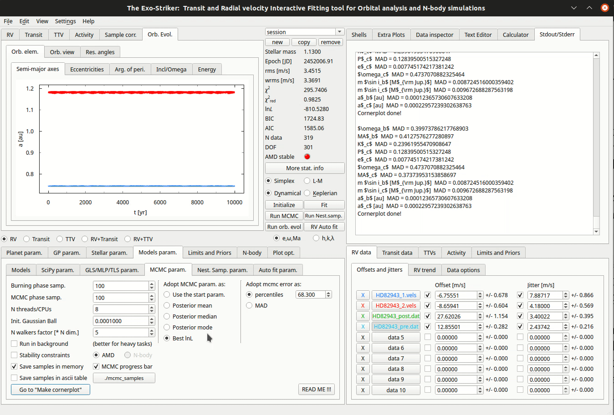

.. _otbfpu:

Obtaining the best fit parameters uncertainties
...............................................

Obtaining the best fit parameters uncertainties I (Markov Chain Monte Carlo)
============================================================================

In order to perform a parameter distribution analysis and estimate the best fit parameters uncertainties,
they need to be coupled with a *Markov chain Monte Carlo* sampling scheme using the *emcee sampler*. 

.. figure:: images/mcmc.gif
   :target: _images/mcmc.gif

   *Markov Chain Monte Carlo method.*

First, fill the parameters in *MCMC param.* (Models param.) on I/O parameters panel.

* **Burning phase samp.** : First steps in the MCMC chain to let the walkers explore the parameter space (At least 1000).
* **MCMC phase samp.** : Represents the total amount of samples (At least 5000).
* **N threads/CPUs** : Number of CPUs from your local machine that will be used for this process.
* **Init. Gaussian Ball** : How far from the starting point the sampler will start producing samples.
* **N walkers factor** : Each walker will produce a different chain that will explore the parameter space (N walkers factor * DOF). 

Then, select between the options in *Adopt MCMC param. as*. In this tutorial we select the *best
maximum likelihood*.

Now, everything is ready for the MCMC process to start **(Run MCMC)**. Different sets of parameters are being tested, **starting
from the best ones that are already obtained**, and for each set the log likelihood is calculated. Thats how the parameters space is being
explored. If a better lnL is found then its set of parameters is counted as errors on the initial (from the best fit). 

For the purposes of this tutorial the values of *Burning phase & MCMC phase samples* are low, for the process to finish
at a reasonable time. Sometimes the MCMC process can range several hours, depending on the amount of samples and the
dimensions of the system (N data minus DOF). You can always check the MCMC progress at the **Stdout/Stderr** on the Help 
widgets area.

.. NOTE::
   **Keep in mind** that setting bounds on the parameters space, on the *Limits and Priors*, in the I/O parameters section, will save
   computational time. In the previous tutorial we set the them empirically. 

   *Customize cornerplots.*

When the process is over, the samples are ready! *Go to "Make Cornerplot"* option redirectes to the *Plot options*. 
There a customization of the cornerplot is offered but also an option to include/exclude parameters from
being printed. By pressing *Make cornerplot* the final results are extracted on your local exostriker folder as a pdf
format. 

.. figure:: images/histograms.png
   :target: _images/histograms.png

   *Final histograms.*

In our case the final histograms show the posterior MCMC distribution of the fitted parameters with a dynamical modeling scheme whose orbital
configuration is edge-on and coplanar. The histogram panels in the figure provide a comparison between the probability density distribution
of the overall MCMC samples for each fitted parameter. The two-dimensional parameter distribution panels represent all possible parameter 
correlations with respect to the best dynamical fit (starting point), whose position is marked with blue lines. In color red all the samples
are represented. Also The red 2D contours are constructed from the overall MCMC samples and indicate the 68.3%, 95.5%, and 99.7% confidence
levels (i.e., 1 sigma, etc.).

Further information about `emcee sampler`_ and its modes can be found on `emcee documentation`_.

.. _emcee sampler: https://github.com/dfm/emcee
.. _emcee documentation: https://emcee.readthedocs.io/en/stable/

Obtaining the best fit parameters uncertainties II (Nested Sampling)
====================================================================

A modern way to perform parameter distribution analysis is by the *Nested Sampling technique*
using the *DYNESTY* sampler. Nested Sampling algorithm is a computational approach to the Bayesian statistics
problems of comparing models and generating samples from the posterior distributions.

.. figure:: images/ns1.gif
   :target: _images/ns1.gif

   *Nested Sampling method.*

First, fill the parameters in *Nest. Samp. param.* (Models param. section) on the I/O parameters panel aswell.

* **Static** : Static sampling, the number of live points remain constant.
* **Dynamic** : Dynamic sampling, the number of live points vary during runtime.
* **Dynamic samp. opt.** : Some sampling options. 
* **N threads/CPUs** : Number of CPUs from your local machine that will be used for the process.
* **dlogz stop** : Stopping criterion.
* **Live points factor** : Number of live points used (live points factor * DOF).

Then, a selection between the options in *Adopt MCMC param. as* is required, in this tutorial we select the *best
maximum likelihood*. *Dynesty* also supports a number of options for bounding the target distribution (*Dynesty bound opt.*).
Unlike MCMC, Nested Sampling starts by randomly sampling from the entire parameter space specified by the prior.

In this tutorial we run *dynesty* **(Run Nest. samp)** using the default exostriker settings to highlight performance in a "typical" 
use case. You can always check the progress of the sampling at *Stdout/Stderr* on Help widgets area. 

.. figure:: images/ns2.gif
   :target: _images/ns2.gif

   *Customize cornerplots.*

When the process is over, the samples are ready! *Go to "Make Cornerplot"* option redirectes to the *Plot options*. 
There a customization of the cornerplot is offered but also an option to include/exclude parameters from
being printed. By pressing *Make cornerplot* the final results are extracted on your local exostriker folder as a .pdf
format. 

.. figure:: images/ns1.png
   :target: _images/ns1.png

   *Final histograms.*

The final histograms show the posterior distribution of the fitted parameters with a dynamical modeling scheme whose orbital
configuration is edge-on and coplanar. The histogram panels in the figure provide a comparison between the probability density distribution
of the overall NS samples for each fitted parameter. The two-dimensional parameter distribution panels represent all possible parameter 
correlations with respect to the best dynamical fit (starting point), whose position is marked with red lines. In color blue all the samples
are represented. Also The blue 2D contours are constructed from the overall NS samples and indicate the 68.3%, 95.5%, and 99.7% confidence
levels (i.e., 1 sigma, etc.).

Further information about `DYNESTY`_ and its modes can be found on `dynestys documentation`_.

.. _DYNESTY: https://github.com/joshspeagle/dynesty
.. _dynestys documentation: https://dynesty.readthedocs.io/en/latest/index.html

.. NOTE::
   The same procedure is applicable when the RVs are combined with Transits.