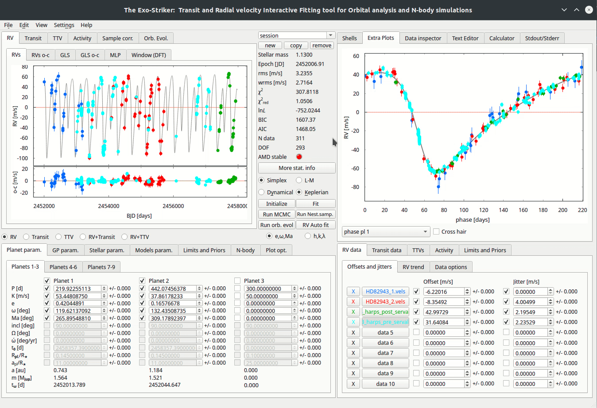

.. _rvs:

Radial Velocity data
....................

There are 3 ways to load RV data on exostriker.

*  the **first** is through the **Data area**.

.. figure:: images/1addrv.gif
   :target: _images/1addrv.gif

   *Data area.*

* the **second** is through the **Data inspector** on the *Help widgets area*.

.. figure:: images/2addrv.gif
   :target: _images/2addrv.gif

   *Data inspector.*

* the **third** is also through the *Data inspector* but from the **RVBank** option. 

.. figure:: images/3addrv.gif
   :target: _images/3addrv.gif

   *RVBank.*

---------------------------------------------------------------------------------------

Fitting the RV data
===================

Now lets perform a **simple fit** to RV data to showcase how exostriker works and we will
explain the remaining GUI options as a part of each tutorial.

*  Inspecting for **periodicities** on the RV signal.

In this tutorial we will fit the RV data with a **Keplerian model**. This model uses the radial 
velocity equation to fit the data. It's a model of motion of the star as expected from Kepler's laws. 

.. figure:: images/checkperiodrv.gif
   :target: _images/checkperiodrv.gif

   *Simple Fit.*
  

By **fitting the data** (Fit option), exostriker fixes the Offset parameters and also applies the jitters (jitter is **only included on Simplex algorithm**).
A curve is applied on the data by the *RV Auto fit* option. It is proper to fit between the 
Simplex & L-M algorithms and notice how the Statistical parameters change in order to acquire the best fit.
Now we notice that the RVs signal is a periodic function. On the **GLS section** (*generalized Lomb-Scargle periodogram*),
the periodogram of our initial RVs signal is presented, including the main peaks that it is 
consisted of. Every significant peak needs investigation on whether it is a planet or stellar activity (Check **Activity indicators** on help widgets area, GEUI Layout section).
Check how the signal changes when the jitter is inlcuded.
In this tutorial the RVs signal is consisted of two planets.
A phase diagram of each significant peak is displayed by selecting *Extra Plots*. 

* Checking the **residual signal**. 

The *RVs o-c* & *GLS o-c* panels represent the residual RVs signal and periodogram each time
a planet is included in the analysis. The *Adopt best Period* option will include the strongest peak of the residual signal to the analysis.

   *Residual signal.*

Furthermore, calculate *MLP (Maximum Likelihood Periodogram)* on **MLP** section, to investigate which periods have significant likelihoods.

.. figure:: images/mlp.gif
   :target: _images/mlp.gif

   *Maximum Likelihood Periodogram.*

If the statistical parameters of a model are maximized/minimized, then probably 
the **best Keplerian fit** is adopted. 

----------------------------------------------------------------------------------------

Multiplanetary systems
======================

In case of **multiplanetary systems** it is kind to consider the planets masses and distances from each other (close orbits).
Massive planets with close distances from the host star, will surely interact with each other due to gravity. 
Then a further investigation using the **Dynamical model** is necessary. That will take into account the
gravitational interactions between the massive bodies by intergrating the equations of motion using the 
*Gragg-Bulirsch-Stoer* method.

   *Dynamical fit.*

Before enabling the **Dynamical** option make sure that the orbital parameters that are acquired so far 
correspond to the **best Keplerian fit**, because they will be used as an initial guess for this *Dynamical fit*.
The next thing to be noticed is that the orbital parameters inclination (i) and the longitude 
of the ascending node (Ω) become available. The dynamical model has the advantage of being able to fit for 
mutually inclined orbits. For the purposes of this tutorial we assume edge-on coplanar
orbits (i=90, Ω=0) for consistency with the unperturbed Keplerian frame and in order to work with minimum
dynamical masses.

