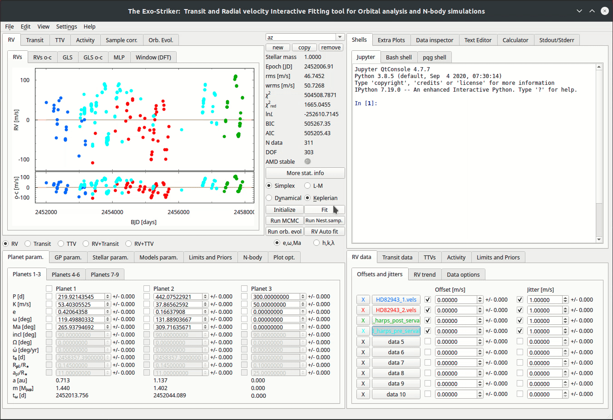

.. _rvs:

Radial Velocity data
....................

There are 3 ways to load RV data on exostriker.

*  the **first** is through the **Data area**.

.. image:: images/1addrv.gif

* the **second** is through the **Data inspector** on the *Help widgets area*.

.. image:: images/2addrv.gif   

* the **third** is also through the **Data inspector** but from the RVBank option.

.. image:: images/3addrv.gif

---------------------------------------------------------------------------------------

Fitting the RV data
===================

Now lets perform a **simple fit** to data to showcase how exostriker works and we will
explain the remaining GUI options as a part of each tutorial.

*  Inspecting for **periodicities** on the RV graph.

In this tutorial we will fit the RV dataset with the **Keplerian model**. This model uses the radial 
velocity equation to fit the data. It's a model of motion of the star as expected from Kepler's laws. 

  

By *fitting* the data (Fit option), exostriker fixes the Offset parameter and also applies the jitter (jitter is only included on Simplex).
A curve is applied on the data by the *RV Auto fit* option. It is proper to fit between the 
Simplex & L-M algorithms and notice how the Statistical parameters change in order to acquire the best fit.
Now we notice that the RV graph is a periodic function. On the *GLS* (*generalized Lomb-Scargle periodogram*) section,
the periodogram of our initial RV periodic function is presented, including the main peaks that it is 
consisted of. Every significant peak needs investigation of whether it is a planet or stellar activity.
Check how the signal is changed when you include the jitter.
In this tutorial the initial signal is consisted of two planets.
A phase diagram of each significant peak is displayed by selecting *Extra Plots*. 

* Checking the **residual signal**. 

The *RVs o-c* & *GLS o-c* panels represent the residual RV signal and periodogram each time
a planet is included in the analysis. Calculate MLP (Maximum Likelihood Periodogram) on MLP section, to further
check which periods have significant likelihoods.

If the statistical parameters of a model are maximized/minimized then, probably 
the **best Keplerian fit** is adopted. 

----------------------------------------------------------------------------------------

Multiplanetary systems
======================

In case of *multiplanetary systems* it is kind to consider the planets masses and distances from each other (close orbits).
Massive planets with close distances from the host star, will surely interact with each other due to gravity. 
Then a further investigation using the **Dynamical model** is necessary. That will take into account the
gravitational interactions between the massive bodies by intergrating the equations of motion using the 
*Gragg-Bulirsch-Stoer* method.

.. image:: images/dynamicalrv.gif

Before enabling the *Dynamical option* make sure that the orbital parameters that are acquired so far 
correspond to the *best Keplerian fit*, because they will be used as a first guess for this *Dynamical fit*.
The next thing to be noticed is that the orbital parameters inclination (i) and the longitude 
of the ascending node (Ω) become available. The dynamical model has the advantage of being able to fit for 
mutually inclined orbits. For the purposes of this tutorial we assume edge-on coplanar
orbits (i=90, Ω=0) for consistency with the unperturbed Keplerian frame and in order to work with minimum
dynamical masses.

The difference in the phase diagrams between the two models is significant! 

