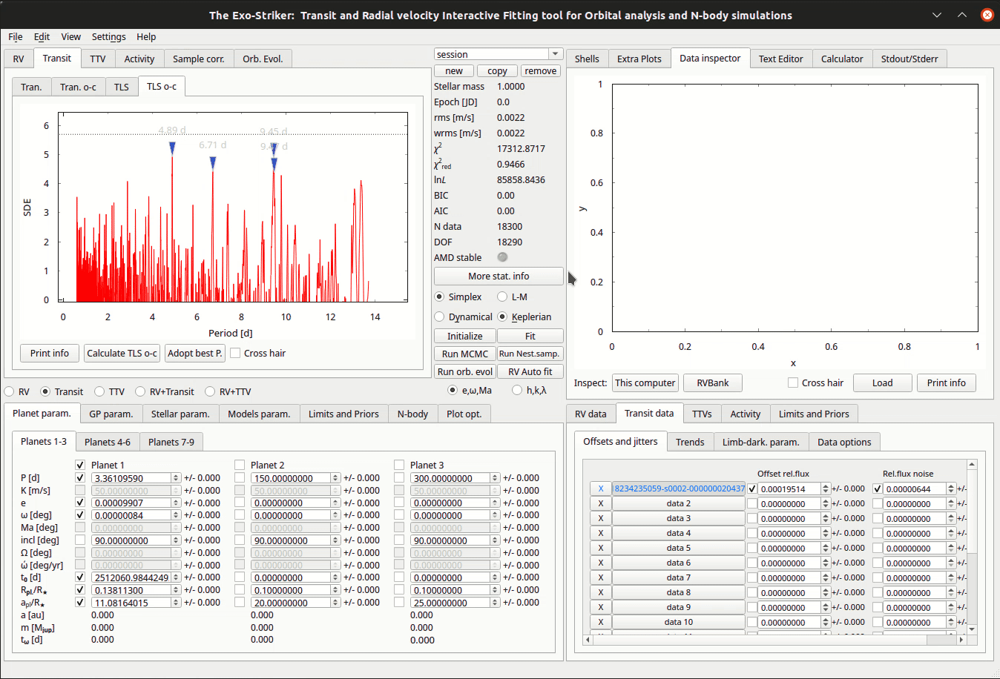
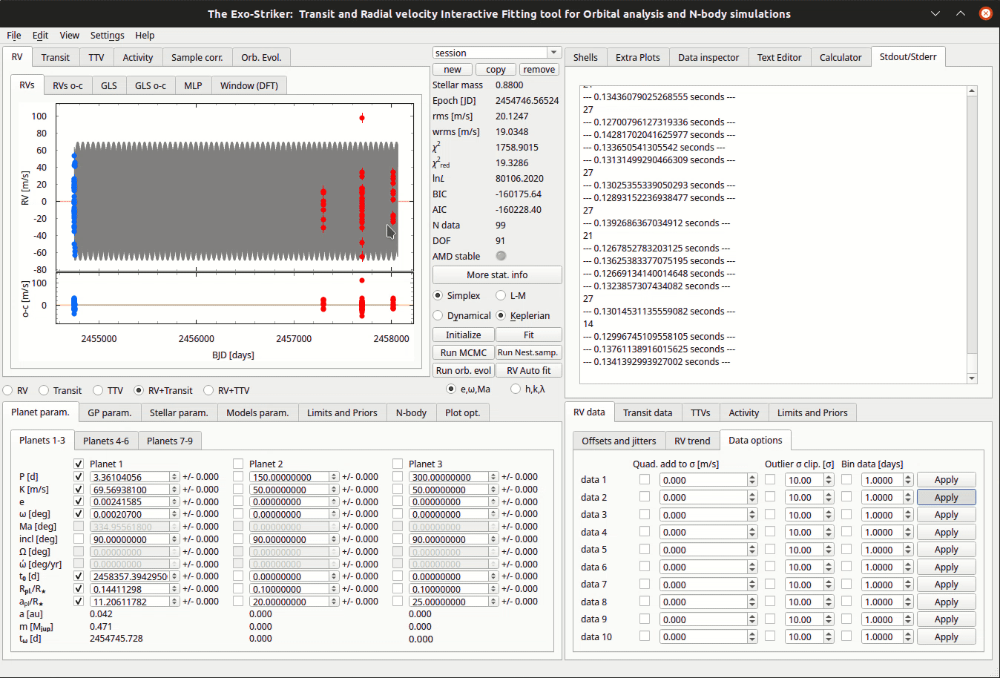

.. _rvtran:

RVs & Transits combined
.......................

Obtaining the Mass of a planet
==============================

From Transits the mass of a planet cannot be obtained directly, they need to be combined 
with Radial Velocities. *Exostriker* offers you that possibility on the *RV+Transit* option in I/O parameters
area. 

Besides loading Transits mentioned in the previous section, load the RVs for the same system through the *RV Bank*.
In the *Models param.* panel set the *Epoch* of the first RV measurement to extend the model to cover the RV data. In the tutorial
above we analyze the system WASP-6b. Keep in mind that the parameter **t**\ :sub:`0`\ **[d]** on I/O parameters panel represents the time of 
the *first* Transit, while the parameter **t**\ :sub:`ω`\ **[d]** (Epoch) represents the time of the *first* RV measurement.

After combining both data sets, the first estimation of the **planets mass** is obtained. By including all
the appropriate parameters such as stellar parameters to a model, a better estimation is acquired. Then minimize/maximize 
the statistical parameters in *Statistics and control panel* using *Simplex* & *L-M* algorithms, and the model is ready to go through MCMC or Nested
sampling for the posterior errors to be calculated (*Obtaining the best fit parameters uncertainties Ι & ΙΙ sections*).

---------------------------------------------------------------------------------------------------------------

In the following tutorial we present how to **bin RV data** when the data set has many observations during a 
very short period of time. 

In the example above the data set has ~10 RV observations in a time span of 1 hour. By binning the
data through eg. 0.02 days, you only accept RV measurements with minimum period of ~30 minutes between 
2 observations.

