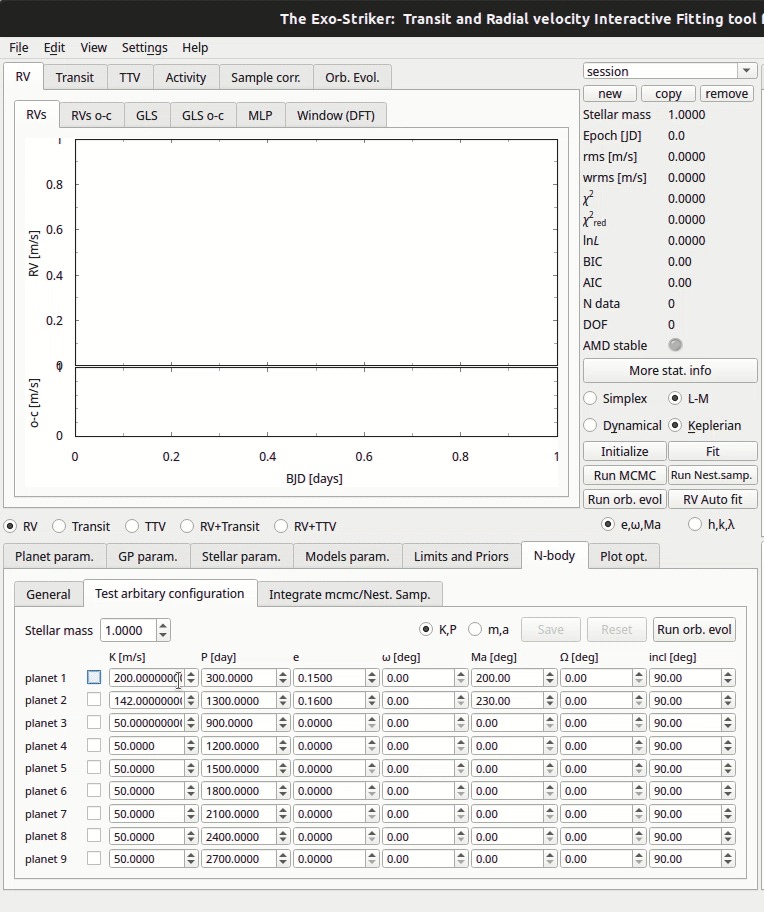

.. _stability:

Stability analysis
..................

Performing an orbital evolution
===============================

At this point we can perform an orbital evolution, using the *SyMBA N-body
symplectic integrator*, in order to notice how the orbital parameters develop with time.
In the following tutorial the system consists of two planets. 

.. figure:: images/1orbitalevo.gif
   :target: _images/1orbitalevo.gif

   Running an *orbital evolution* with Keplerian model.

First the stellar parameters need to be distinguished, by changing the values
of *Stellar param.* on the I/O parameters section. Then add the maximum time of evolution
by clicking at *N-body* and the appropriate time step. Running orbital evolution (*Run orb. evol*) automatically redirects
to the *Orb. Evol* section, where the orbital parameters evolution is revealed.

.. figure:: images/dynamicalorb.gif
   :target: _images/dynamicalorb.gif

   Running an *orbital evolution* with Dynamical model.

Evaluating the *stability of a system* means that the orbital parameters have to be examined long-term (e.g 1Myr) and with a time
step of at least 100 points per orbit. For example, if the inner planet has a period of 200 days, then a time step of 2 
days is required. In case of planet–planet close encounters *SyMBA* automatically reduces the time step to ensure
an accurate simulation with high orbital resolution. *SyMBA* also checks for planet–planet or planet–star collisions or
planetary ejections and interrupts the integration if they occur. 

!! Say some words about MVS & MVS_GR integrators !!

----------------------------------------------------------------------------------------------------

Test arbitrary configuration
============================

In the *test arbitrary configuration* section orbital evolution tests with fixed values of planetary
parameters can be run and their evolution parameters can be examined.

Options between the planets RV amplitude & period **or** planets mass & semimajor axis are
provided. In the previous tutorial we test a two planet system.

----------------------------------------------------------------------------------------------------

Integrate mcmc/Nest. Samp. (Work in progress)

