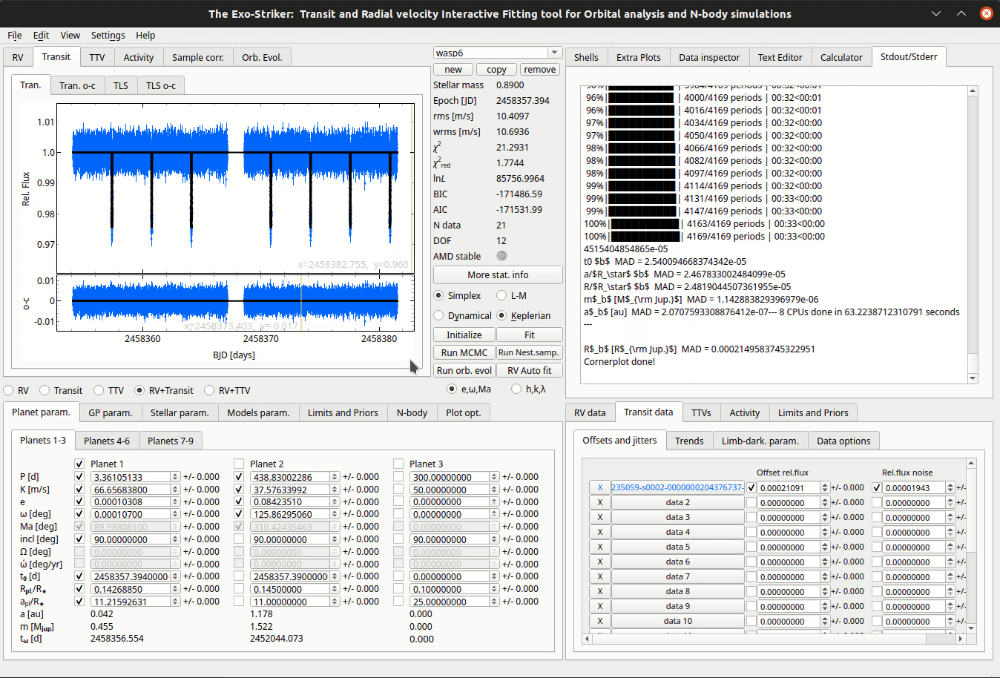

.. _transit:

Transit data
............

There are 2 ways to load Transit data on exostriker.

*  the **first** is through the **Data area**.

.. figure:: images/tra1.gif
   :target: _images/tra1.gif

   *Data area.*

loading a *.fits* file (Flexible Image Transport System), a pop up appears with two options : 
   
   * **SAP FLUX** (Simple Aperture Photometry) : raw data.
   * **PDCSAP FLUX** : cleaner data than the SAP flux with fewer systematic trends (recommended).

* the **second** is through the **Data inspector** on the *Help widgets area*. (only for .tran
  extensions)

.. figure:: images/tra2.gif
   :target: _images/tra2.gif

   *Data inspector.*

---------------------------------------------------------------------------------------------

Detrending the Light curve
===========================

After a .fits data file is inserted, it still needs to be **normalized**. For that process *exostriker*
uses the **wotan** python package. Wotan automatically remove trends from time-series data.
A wide range of normalization methods are offered in the *Detrend options*
on the **Data area section**. In the following tutorial we use the Gaussian processes normalization.

   *Detrending the light curve.*

For further information on the detrending algorithms see `wotan`_ and its `documentation`_.

.. _wotan: https://github.com/hippke/wotan

.. _documentation: https://wotan.readthedocs.io/en/latest/

----------------------------------------------------------------------------

Looking for Transits
====================

* Inspecting for **periodicities** on the Transit graph.

When the light curve is detrended, a **period search** using the *Transit Least Squares* algorithm **(TLS)** 
can be performed **(Calcute TLS*)**. The result is a prominent peak followed by its harmonics. The empirical
transit detection threshold is SDE > 8, Signal Detection Efficiency, (Aigrain et al. 2016).

.. figure:: images/tls.gif
   :target: _images/tls.gif

   *Transit period search.*

* **Applying the model** on the data.

When the planets period is obtained it can be included to the model with other planet parameters.
In the following tutorial we also adopted a quadratic limb-darkening model to describe the transit 
signal shape, adding two more parameters, u1 and u2.

   *Fitting a transit.*

The **phase folded planetary signal** can be investigated on *Plot opt.*, when the option
*plot phase-folded* is enabled.

   *Phase folded transit.*

* Checking the **residual signal**.

If there are any other periodicities left on the residual signal they can be calculated
on the *TLS o-c section*. If there aren't any peaks left on the *TLS o-c graph*, a message that 
*You have reached the maximum number of TLS peaks* will be shown on *Stdout/Stderr* panel.

.. figure:: images/residtls.gif
   :target: _images/residtls.gif

   *Residual signal.*

