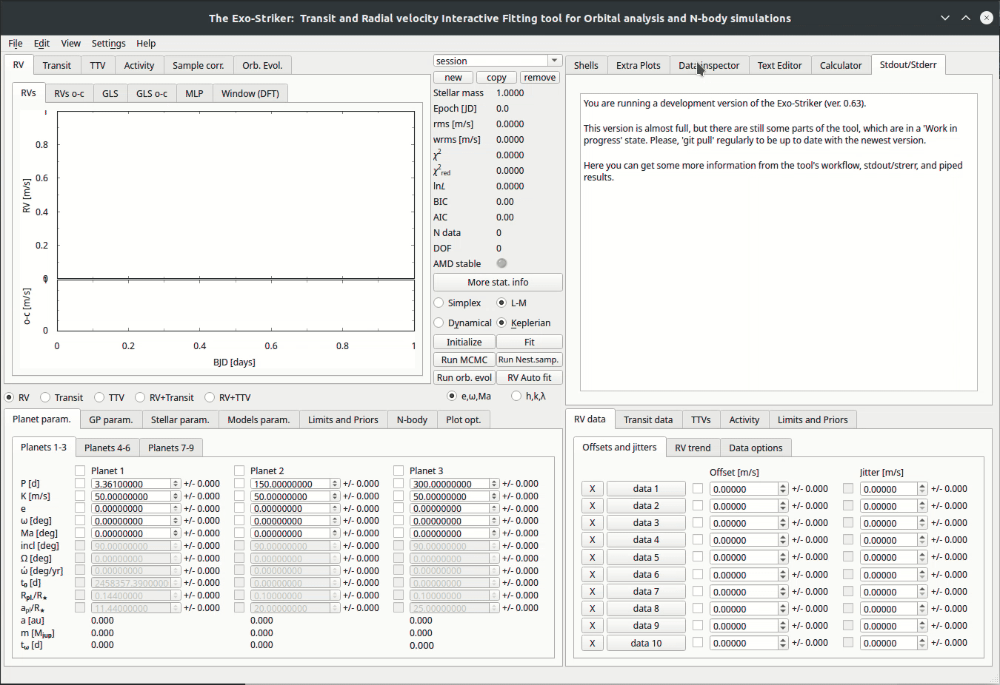
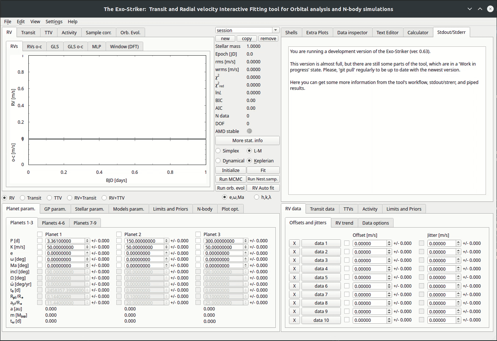
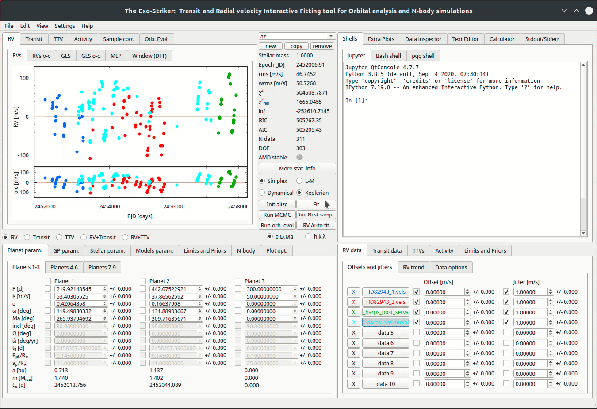
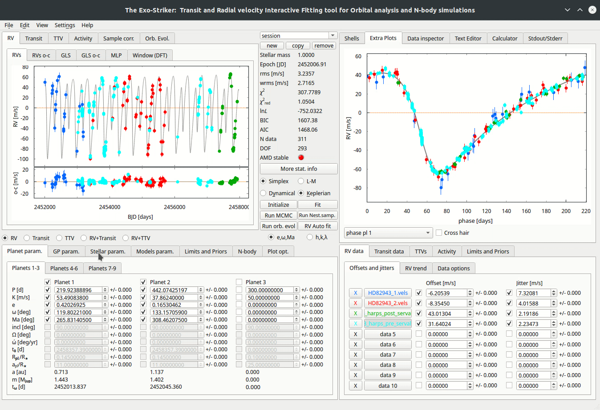

.. _tutorials:

Introduction
............

Before starting the tutorials, it is kind to familiarize yourself with the
basic parameters that exostriker uses to determine the goodness of a fit but also
the ones that describe the planet orbits. All of these parameters can be seen on the 
homepage of exostriker.

.. figure:: /images/homepage.png
   

   *Home Page of the GUI*

**Some statistical parameters**

* **rms**: root-mean-square, the root-mean-square deviation of an estimator is a measure of the imperfection of the fit of the estimator to the data.
* **wrms**: weighted root-mean-square.
* **χ**\ :sup:`2`: chi-squared.
* **χ**\ :sup:`2` :sub:`reduced`\: chi-squared reduced, ~ 1 for a good fit.
* **lnL**: likelihood function, describes the odds that a model fits your expectations/data, we use this funtion for comparison between models. The model with higher value is preferred.
* **BIC**: Bayesian information criterion, can be used to compare models **only** when the numerical values of the dependent variables (like χ\ :sup:`2` & lnL) are identical for all models being compared, the model with the lowest BIC is preferred.
* **AIC**: Akaike information criterion, estimates the relative amount of information lost by a given model. The less information a model loses, the higher the quality of it. The smaller the AIC the less information is lost (comparison between models).
* **N data**: number of data/observations.
* **DOF**: degrees of freedom , the value is a result of subtracting all the parameters in the fit from total number of data points. 

**Some options to fit your model**

* **Simplex**: fitting curves to data using the Simplex algorithm.
* **L-M**: fitting curves to data using the Leveberg-Marquardt algorithm.
* **Keplerian**: a Keplerian analysis is performed on the data.
* **Dynamical**: a dynamical analysis is performed on the data.
* **Initialize**: ?
* **Fit**: optimization parameter. fix the offsets
* **Run MCMC**: ?
* **Run Nest.samp**: ?
* **Run orbital evolution**: runs an orbital evolution to your data.
* **RV auto fit**: fits the data.

**Planet & orbital parameters**

* **P [d]**: planets period.
* **K [m/s]**: planets RV amplitude. 
* **e**: eccentricity of the planets orbit.
* **ω [deg]**: argument of periastron.
* **Ma [deg]**: mean anomaly at the first observational epoch.
* **inc**: orbits inclination.
* **Ω [deg]**: longitude of the ascending node.  
* **ώ [deg/yr]**: ? 
* **t**\ :sub:`0`\ **[d]**: ? 
* **R**\ :sub:`pl`\ /**R**\ :sub:`*`\ : planets radius to stars radius ratio.
* **a**\ :sub:`pl`\ /**R**\ :sub:`*`\ : planets distance to stars radius ratio.
* **a [au]**: planets distance from the central star.
* **m** [**M**\ :sub:`jup`\ ] : planets mass. 
* **t**\ :sub:`ω`\ [**d**]: ? 

Now, depending on the type of data that you are trying to fit, you have to choose
between Radial Velocities (RV data), Transits (Transit data) and TTVs on the 
**bottom right panel** and then add the data files.

(but now lets perform a **simple fit** to data to showcase how exostriker works and we will
explain the remaining GUI options as a part of each tutorial.)

----------------------------------------------------------------------------------------------

Adding the RV data
..................

*There are 3 ways to load RV data on exostriker*

*  the **first** is through the **bottom right panel**

.. image:: images/1addrv.gif

   

* the **second** is through the **Data inspector** on the top right panel

   

* the **third** is also through the **Data inspector** but from the RVBank option

---------------------------------------------------------------------------------------

Fitting the RV data
===================

Now lets perform a **simple fit** to data to showcase how exostriker works and we will
explain the remaining GUI options as a part of each tutorial.

*  Inspecting for **periodicities** on the RV graph.

In this tutorial we will fit the RV dataset with the **Keplerian model**. This model uses the radial 
velocity equation to fit the data. It's a model of motion of the star as expected from Kepler's laws. 

  

By *fitting* the data (Fit option), exostriker fixes the Offset parameter and also applies the jitter (jitter is only included on Simplex).
A curve is applied on the data by the *RV Auto fit* option. It is proper to fit between the 
Simplex & L-M algorithms and notice how the Statistical parameters change in order to find the best fit.
Now we notice that the RV graph is a periodic function. On the *GLS* window, on the top left panel, you can
see the periodogram of our initial RV periodic function but also the main peaks that it is 
consisted of. Every significant peak needs investigation of whether it is a planet or stellar activity.
In this tutorial the initial signal is consisted of two planets.
You can check the phase diagram of each peak by selecting *Extra Plots*. 

The *RVs o-c* & *GLS o-c* windows represent the residual RV signal and periodogram each time
a planet is included in the analysis. 

If the statistical parameters of your fit are maximized/minimized the you have probably 
obtained the *best Keplerian fit* of your model. 

----------------------------------------------------------------------------------------

In case of multiplanetary systems it is kind to consider the planet masses and distances from each other.
Massive planets with close distances from the host star, will surely interact with each other due to gravity. 
Then a further investigation using the **Dynamical model** is necessary. That will take into account the
gravitational interactions between the massive bodies by intergrating the equations of motion using the 
Gragg-Bulirsch-Stoer method.

Before you enable the Dynamical option make sure that the orbital parameters that are acquired so far 
correspond to the **best Keplerian fit**, because they will be used as a first guess for this fit.
The next thing that you need to notice is that the orbital parameters inclination (i) and the longitude 
of the ascending node (Ω) become available. The dynamical model has the advantage of being able to fit for 
mutually inclined orbits. For the purposes of this tutorial we assume edge-on coplanar
orbits (i=90, Ω=0) for consistency with the unperturbed Keplerian frame and in order to work with minimum
dynamical masses.

------------------------------------------------------------------------------------------

*  Performing an **orbital evolution**.

At this point we can perform an orbital evolution in order to notice how
the orbital parameters develop with time.

First you need to distinguish the stellar parameters, by changing the values
of *Stellar param.* on the bottom left panel. Then add the maximum time of evolution
by clicking at *N-body*. Run orbital evolution (*Run orb. evol*) and you will be 
transfered automatically to the *Orb. Evol* panel, where you can see how the orbital parameters 
evolve with time.

----------------------------------------------------------------------------------------------

WARNING
Both the Keplerian and dynamical fits reveal a moderate
best-fit value of e c for the eccentricity of the outer planet but
with a large uncertainty toward nearly circular orbits. This
indicates that e c is likely poorly constrained, and perhaps this
moderate eccentricity value is a result of overfitting. Indeed, a
two-planet Keplerian model with circular orbits (i.e., e b,c ,
ω b,c =0) has - ln  = 150.286 , meaning that the difference
between the circular and noncircular Keplerian models is only
D ln  ≈1.5, which is insignificant. 11 Thus, we conclude that
neither the Keplerian nor the dynamical model applied to the
current RV data can place tight constraints on the orbital
eccentricities. ???

-------------------------------------------------------------------------------------------------

MCMC

For parameter distribution analysis and uncertainty esti-
mates, we couple our MLE fitting algorithm with a Markov
chain Monte Carlo (MCMC) sampling scheme using the emcee
sampler (Foreman-Mackey et al. 2013). For all parameters, we
adopt flat priors (i.e., equal probability of occurrence), and
we run emcee from the best fit obtained by the MLE. We select
the 68.3% confidence levels of the posterior MCMC parameter
distribution as 1σ parameter uncertainties.

To estimate the parameter uncertainties of our best fits and to
perform a parameter distribution analysis, we rely on a Markov
chain Monte Carlo (MCMC) sampling using the emcee sampler
(Foreman-Mackey et al. 2013)