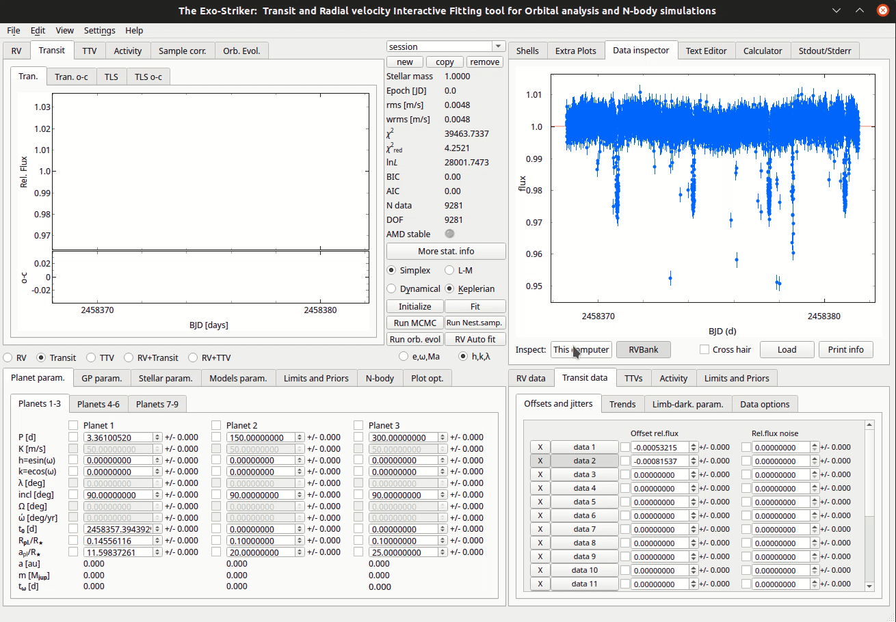

.. _tutorials:

GUI Layout
..........

Before starting the tutorials, it is kind to familiarize yourself with the
basic parameters that exostriker uses to determine the goodness of a fit but also
the ones that describe the planet orbits. All of these parameters can be seen on the 
homepage of exostriker.

.. figure:: /images/homepage.png
   

   *Home Page of the GUI*

**Statistical parameters**

* **rms**: root-mean-square.
* **wrms**: weighted root-mean-square.
* **χ**\ :sup:`2`: chi-squared.
* **χ**\ :sup:`2` :sub:`reduced`\ : chi-squared reduced.
* **lnL** : likelihood function.
* **BIC** : Bayesian information criterion.
* **AIC** : Akaike information criterion.
* **N data**: number of data/observations.
* **DOF**: degrees of freedom. 

**Control parameters**

* **Simplex** : fitting curves using the Simplex algorithm.
* **L-M** : fitting curves using the Leveberg-Marquardt algorithm.
* **Keplerian** : perform a Keplerian analysis.
* **Dynamical**: perform a Dynamical analysis.
* **Initialize**: ?
* **Fit**: optimization parameter.
* **Run MCMC** : generates samples using the Markov chain Monte Carlo algorithm.
* **Run Nest.samp** : generates samples using the Nested sampling alogithm.
* **Run orbital evolution**: run orbital evolution.
* **RV auto fit**: a curve is applied to data.

**Input/Output parameters**

* **P [d]**: planets period.
* **K [m/s]**: planets RV amplitude. 
* **e**: eccentricity of the orbit.
* **ω [deg]**: argument of periastron.
* **Ma [deg]**: mean anomaly at the first observational epoch.
* **inc**: inclination of the orbit.
* **Ω [deg]**: longitude of the ascending node.  
* **ώ [deg/yr]**: ? 
* **t**\ :sub:`0`\ **[d]**: time of inferior transit conjunction.
* **R**\ :sub:`pl`\ /**R**\ :sub:`*`\ : planet radius in units of stellar radius.
* **a**\ :sub:`pl`\ /**R**\ :sub:`*`\ : planet semimajor axis in units of stellar radius.
* **a [au]**: semimajor axis.
* **m** [**M**\ :sub:`jup`\ ] : planets mass. 
* **t**\ :sub:`ω`\ [**d**]: ? 

Now, depending on the type of data that you are trying to fit, you have to choose
between Radial Velocities (RV data), Transits (Transit data) and TTVs on the 
**Data area** and then add the data files.

----------------------------------------------------------------------------------------------

Adding the RV data
..................

*There are 3 ways to load RV data on exostriker*.

*  the **first** is through the **Data area**.

.. image:: images/1addrv.gif

   

* the **second** is through the **Data inspector** on the *Help widgets area*.

   

* the **third** is also through the **Data inspector** but from the RVBank option.

.. image:: images/3addrv.gif

---------------------------------------------------------------------------------------

Fitting the RV data
===================

Now lets perform a **simple fit** to data to showcase how exostriker works and we will
explain the remaining GUI options as a part of each tutorial.

*  Inspecting for **periodicities** on the RV graph.

In this tutorial we will fit the RV dataset with the **Keplerian model**. This model uses the radial 
velocity equation to fit the data. It's a model of motion of the star as expected from Kepler's laws. 

.. image:: images/checkperiodrv.gif
  

By *fitting* the data (Fit option), exostriker fixes the Offset parameter and also applies the jitter (jitter is only included on Simplex).
A curve is applied on the data by the *RV Auto fit* option. It is proper to fit between the 
Simplex & L-M algorithms and notice how the Statistical parameters change in order to find the best fit.
Now we notice that the RV graph is a periodic function. On the *GLS* window (generalized Lomb-Scargle periodogram), on the top left panel, you can
see the periodogram of our initial RV periodic function but also the main peaks that it is 
consisted of. Every significant peak needs investigation of whether it is a planet or stellar activity.
In this tutorial the initial signal is consisted of two planets.
You can check the phase diagram of each peak by selecting *Extra Plots*. 

The *RVs o-c* & *GLS o-c* windows represent the residual RV signal and periodogram each time
a planet is included in the analysis. 

If the statistical parameters of your fit are maximized/minimized then you have probably 
obtained the *best Keplerian fit* of your model. 

----------------------------------------------------------------------------------------

Multiplanetary systems
======================

In case of *multiplanetary systems* it is kind to consider the planet masses and distances from each other (close orbits).
Massive planets with close distances from the host star, will surely interact with each other due to gravity. 
Then a further investigation using the **Dynamical model** is necessary. That will take into account the
gravitational interactions between the massive bodies by intergrating the equations of motion using the 
*Gragg-Bulirsch-Stoer* method.

.. image:: images/dynamicalrv.gif

Before you enable the *Dynamical option* make sure that the orbital parameters that are acquired so far 
correspond to the *best Keplerian fit*, because they will be used as a first guess for this fit.
The next thing that you need to notice is that the orbital parameters inclination (i) and the longitude 
of the ascending node (Ω) become available. The dynamical model has the advantage of being able to fit for 
mutually inclined orbits. For the purposes of this tutorial we assume edge-on coplanar
orbits (i=90, Ω=0) for consistency with the unperturbed Keplerian frame and in order to work with minimum
dynamical masses.

The difference in the phase diagrams between the two models is significant! 

------------------------------------------------------------------------------------------

Performing an orbital evolution
===============================

At this point we can perform an orbital evolution, using the SyMBA N-body
symplectic integrator, in order to notice how the orbital parameters develop with time.

.. figure:: images/1orbitalevo.gif

   Running an *orbital evolution* with Keplerian model.

First the stellar parameters need to be distinguished, by changing the values
of *Stellar param.* on the bottom left panel. Then add the maximum time of evolution
by clicking at *N-body*. Run orbital evolution (*Run orb. evol*) and you will be 
transfered automatically to the *Orb. Evol* panel, where you can see how the orbital parameters 
evolve with time.

.. figure:: images/dynamicalorb.gif

   Running an *orbital evolution* with Dynamical model.

Evaluating the *stability of a system* means that the orbital parameters have to be examined long-term (e.g 1Myr) and with a time
step of at least 100 points per orbit. For example, if the inner planet has a period of 200 days, then a time step of 2 
days is required. In case of planet–planet close encounters SyMBA automatically reduces the time step to ensure
an accurate simulation with high orbital resolution. SyMBA also checks for planet–planet or planet–star collisions or
planetary ejections and interrupts the integration if they occur. 

A planet is considered lost and the system unstable if, at any time:

* the mutual planet–planet separation is below the sum of their physical radii (assuming Jupiter mean density), i.e., the planets undergo collision.
* the star–planet separation exceeds two times the initial semimajor axis of the outermost planet, which we define as planetary ejection.
* the star–planet separation is below the physical stellar radius (R ≈ 0.03 au), which we consider a collision with the star.

All of these events are associated with large planetary eccentricities leading to crossing orbits, close planetary
encounters, rapid exchange of energy and angular momentum, and eventually instability. Therefore, these somewhat arbitrary
stability criteria are efficient to detect unstable configurations and save CPU time.

----------------------------------------------------------------------------------------------------

Obtaining the best fit parameters uncertainties I
=================================================

In order to perform a parameter distribution analysis, of the best-fit, and estimate their uncertainties,
you need to couple them with a *Markov chain Monte Carlo* (**Run MCMC**) sampling scheme using the *emcee
sampler*. 

.. image:: images/mcmc.gif

First, you need to fill the parameters in *MCMC param.* (Models param.) on I/O parameters panel.

* **Burning phase samp.** : First steps in the MCMC chain to let the walkers explore the parameter space. (At least 1000)
* **MCMC phase samp.** : Represents the total amount of samples. (At least 5000) 
* **N threads/CPUs** : Number of CPUs from your local machine that will be used for this process.
* **Init. Gaussian Ball** : How far from the starting point the sampler will start producing samples.
* **N walkers factor** : Each walker will produce a different chain (N walkers factor * DOF). 

Then, you need to select between the options in *Adopt MCMC param. as*, in this tutorial we select the *best
maximum likelihood* .

Now, everything is ready for the MCMC process to start. A different set of parameters are being tested, **starting
from the best ones that you have already obtained**, and for each set the lnL is being calculated. If a better lnL is
found then its parameters are counted as errors on the initials (from the best fit). 

For the purposes of this tutorial the values of *Burning phase & MCMC phase samples* are low, for the process to finish
at a reasonable time. Sometimes the MCMC process can take from hours to days, depending on the amount of samples and the
dimensions of the system (N data minus DOF). You can always check the MCMC progress at the **Stdout/Stderr** on the top right
panel. 

You can also set some bounds on each parameter on the *Limits and Priors* on the I/O parameters panel. If you are sure about the
range of values of a single parameter, that will save you computational time. In this tutorial we set the boundaries empirically. 

.. image:: images/mcmc1.gif

When the process is over, the samples are ready! Then you can press *Go to "Make Cornerplot"* and you will be
redirected to the *Plot options*. There you can customize the cornerplot but also include/exclude parameters from
being printed. By pressing *Make cornerplot* the final results are extracted on your local exostriker folder as a pdf
format. 

.. figure:: images/histograms.png

   Final histograms.

In our case the final histograms show the posterior MCMC distribution of the fitted parameters with a dynamical modeling scheme whose orbital
configuration is edge-on and coplanar. The histogram panels in the figure provide a comparison between the probability density distribution
of the overall MCMC samples for each fitted parameter. The two-dimensional parameter distribution panels represent all possible parameter 
correlations with respect to the best dynamical fit (starting point), whose position is marked with blue lines. In color red all the samples
are represented. Also The red 2D contours are constructed from the overall MCMC samples and indicate the 68.3%, 95.5%, and 99.7% confidence
levels (i.e., 1σ, 2σ, and 3σ).

Obtaining the best fit parameters uncertainties II
==================================================

A modern way to perform parameter distribution analysis is by the *Nested Sampling technique* (**Run Nest. samp**)
using the *DYNESTY* sampler. Nested Sampling algorithm is a computational approach to the Bayesian statistics
problems of comparing models and generating samples from the posterior distributions.

.. image:: images/ns1.gif

First, you need to fill the parameters in *Nest. Samp. param.* (Models param.) on the I/O parameters panel aswell.

* **Static** : Static sampling, the number of live points remain constant.
* **Dynamic** : Dynamic sampling, the number of live points vary during runtime.
* **Dynamic samp. opt.** : Some sampling options. 
* **N threads/CPUs** : Number of CPUs from your local machine that will be used for the process.
* **dlogz stop** : Stopping criterion.
* **Live points factor** : Number of live points used (live points factor * DOF).

Then, you need to select between the options in *Adopt MCMC param. as*, in this tutorial we select the *best
maximum likelihood*. *Dynesty* also supports a number of options for bounding the target distribution (*Dynesty bound opt.*).

Unlike MCMC, Nested Sampling starts by randomly sampling from the entire parameter space specified by the prior.
This is not possible unless the priors are “proper” (i.e. that they integrate prior to 1). So while normal
priors spanning (−∞, +∞) are fine, uniform priors spanning the same range are not and must be bounded 
(*Limits and Priors*).

In this tutorial we run *dynesty* using the default settings whenever possible to highlight performance in a “typical” 
use case. You can always check the progress of the sampling at *Stdout/Stderr* on help widgets area. 

When the process is over, the samples are ready! Then you can press *Go to "Make Cornerplot"* and you will be
redirected to the *Plot options*. There you can customize the cornerplot but also include/exclude parameters from
being printed. By pressing *Make cornerplot* the final results are extracted on your local exostriker folder as a pdf
format. 

.. figure:: images/ns1.png

   Final histograms.

The final histograms show the posterior distribution of the fitted parameters with a dynamical modeling scheme whose orbital
configuration is edge-on and coplanar. The histogram panels in the figure provide a comparison between the probability density distribution
of the overall NS samples for each fitted parameter. The two-dimensional parameter distribution panels represent all possible parameter 
correlations with respect to the best dynamical fit (starting point), whose position is marked with red lines. In color blue all the samples
are represented. Also The blue 2D contours are constructed from the overall NS samples and indicate the 68.3%, 95.5%, and 99.7% confidence
levels (i.e., 1σ, 2σ, and 3σ).

Further information about *DYNESTY* and its modes can be found on the `documentation`_.

.. _documentation: https://dynesty.readthedocs.io/en/latest/index.html

--------------------------------------------------------------------------------------------------------

Adding the Transit data
.......................

*There are 2 ways to load Transit data on exostriker*.

*  the **first** is through the **Data area**.

.. image:: images/tra1.gif

   
* the **second** is through the **Data inspector** on the *Help widgets area*.

Fitting the Transit data
========================

* Inspecting for **periodicities** on the Transit graph.

transit period search using the transit least
squares (TLS) package

